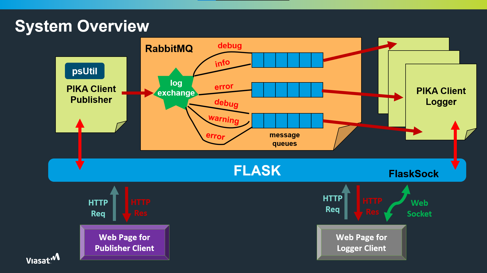

# RMQ Logger App
## Logging Application through RabbitMQ built for Viasat Chevron project

<br>

> ### Problem Statement
> Client and Server communication using python  
> Implement two applications to communicate via RMQ  
> RMQ server running locally  
> Application 1 will publish the current CPU status to RMQ  
> Application 2 will read the result CPU status from RMQ and log it into file

<br>

Running Instructions:
1. Clone the Rep
```
git clone https://github.com/agilan2001/RMQ_Logger_App.git
```
2. Install py requirements
```
pip install -r requirements.txt
```
3. Start the Flask application.
```
flask run
```
<br>

## System Overview


<br>

## Screens

### Home Screen


<br>

### Logger Screen

